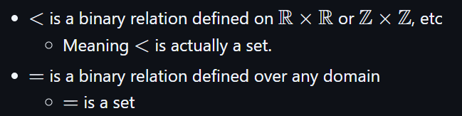

# Relations

Recall the definition of a Cartesian Product (Set of Ordered Pairs): 
- $A \times B = \{(a, b) : a \in A \wedge b \in B\}$

Can be extended to more than two sets
- $A \times B \times C = \{(a, b, c) : a \in A \wedge b \in B \wedge c \in C\}$

> This is sometimes called cross-join

# Relation

- A relation among sets is a subset of their Cartesian Product.
	- Basically, a relation is a subset of a Cartesian Product. 
- Can involve any number of sets but the most common relation is a binary relation which involves two sets

> [!note]
> Relation is commonly denoted as $R$ but here I will be denoting it as $B$ (until a certain section which would be noted) so it is not to be confused with real numbers as Github markdown doesn't render real number correct due to unsupported font.

## Binary Relation

- Defining a binary relation is as simple as: 
	1. Define $B$ as a relation on some cartesian product of two sets suppose $A \times B$ 
		1. This is the same thing as saying that $R \subseteq A \times B$.
	2. $B = \{(a, b) \in A \times B : a \text { relates to } b\}$
	3. Examples:
		1. $a$ eats $b$
		2. $a < b$
		3. $a > b$

Example: Suppose $A = \{1, 5, 4\}$ and $B = \{3, 5, 9\}$ The Cartesian Product of $A \times B = \{(1, 3), (1, 5), (1, 9), (5, 3), (5, 5), (5, 9), (4, 3), (4, 5), (4, 9)\}$
- Let $R$ be a binary relation defined over $A \times B$ $(R \subseteq A \times B)$ such that $(a, b) \in R$ if and only if $a < b$ 
	- This can also be defined as $R = \{(a, b) \in A \times B : a < b\}$
		- There are other ways to define a relation which are covered below
	- $B$ would be a set of all the order pairs such that $a < b$
	- So, $B = \{(1, 3), (1, 5), (1, 9), (5, 9), (4, 5), (4, 9)\}$

> A relation is a set, not a function. Some relations can be functions. 
> - All functions are relations but not all relations are functions.

>[!note]
>
>When defining a binary relation over one set $A$, both the domain and codomain are set $A$. Meaning if $R$ is a binary relation defined over the set $A$ is the same as saying $R \subseteq A \times A$ or $R$ is a binary relation defined over $A \times A$.

## Binary Relation vs Predicates

Recall what a predicate is where $P(a, b)$ is something regarding $a$ relating to $b$ and a predicate is either true or false (a boolean expression). Meanwhile a binary relation is a set.
- Relations and predicates are essentially the same idea. 

Suppose $B$ is a binary relation and $P(a, b)$ is defined as a predicate.
- $(a, b) \in B \leftrightarrow P(a, b)$

Another notation for relation is $a\mathrel B b$ which reads "$a$ relates to $b$" and $B$ is defined as a binary relation therefore expanding the notation above we get:
- $(a, b) \in B \leftrightarrow P(a, b) \leftrightarrow a \mathrel B b$

Non-intuitive examples of binary relation: 

 

> Plotting points on a graph is another way to show binary relations.

## Function as Binary Relation

Any function can be thought as a binary relation Suppose $f : \Bbb N \to \Bbb R$  (Natural Numbers map to Real Numbers)
- We can defined a relation $B = \{(a, b) \in \Bbb N \times \Bbb R : f(a) = b\}$

## $n$-nary Relation

A ternary relation:
- Suppose $B \subseteq \Bbb Z \times \Bbb Z \times \Bbb Z$, we can define $B$ as $(a, b, c) \in B$ if and only if $a \equiv_c b$
- Predicate notation can be $B(a, b, c)$ is true if and only if $a \equiv_c b$

An unary relation involve only one set.
- $B = \{x \in Z : x \text { is prime}\}$
- This is the correct notation but mathematicians like to argue on this notation. Instead, some prefer:
	- $B = \{ (x) \in Z : x \text { is prime}\}$ which is also correct. But rarely anybody writes it like this. 

Relation can involve any number of sets.
- Real number sets - $\Bbb R^n = (\Bbb R \times \Bbb R \times \Bbb R \times \Bbb R \times ..... \times \Bbb R)$
- We can then define $B \subseteq \Bbb R^n$ as some relation.
# Properties of Binary Relation

> [!note] 
> Relation will be denoted as $R$ instead of $B$ here since it makes more sense when defining properties. 

Suppose $A$ is defined as some set and $R$ as a relation defined over $A$. 
1. **Reflexive** : $(\forall a \in A)[a \mathrel R a]$ 
	1. This reads "for all elements in $A$, every element is related to itself."
2. Irreflexive : $(\forall a  \in A)[a \not \mathrel R a]$
	1. This reads "for all elements in $A$, every element is not related to itself."
3. **Symmetric** : $(\forall a, b \in A)[a \mathrel R b \to b \mathrel R a]$
	1. If $a$ relates to $b$ then $b$ must also relates to $a$
4. Antisymmetric : $(\forall a, b \in A)[(a \mathrel R b \wedge b \mathrel R a) \to a = b]$
	1. If $a$ relates to $b$ and $b$ relates to $a$ then $a$ and $b$ must be the same element
5. **Transitive** : $(\forall a, b, c \in A)[(a \mathrel R b \wedge b \mathrel R c) \to a \mathrel R c]$
	1. If $a$ relates to $b$ and $b$ relates to $c$ then $a$ must also relates to $c$
6. **Total** : $(\forall a, b \in A)[a \mathrel R b \vee b \mathrel R a]$
	1. Either $a$ has to be related to $b$ or $b$ is related to $a$. There must be some relation between $a$ and $b$. 

> [!important]
> Reflexive, symmetric and transitivity are the important ones. If all three holds true for a relation then that relation is an equivalence relation. 
>A relation cannot be both reflexive and irreflexive except if the relation is an empty set.
>- Recall that a statement involving universal quantifier over an empty set is vacuously true. 
>
>A relation can be both symmetric and antisymmetric. An example of this is the equal relation. 

Examples: 
- Suppose $R$ is defined over $\Bbb N$ (Natural Numbers) such that $x \mathrel R y$ if and only if $x$ is a factor of $y$
	- This is reflexive an natural number is a factor of itself
	- This is not symmetric since a natural number can be a factor of another natural number but not the other way around unless they are the same number therefore this is antisymmetric. 
	- This is transitive if a natural number $x$ is a factor of another natural number $y$ and the natural number $y$ is a factor of another natural number $z$ then it makes sense that $x$ is also a factor of $z$. 